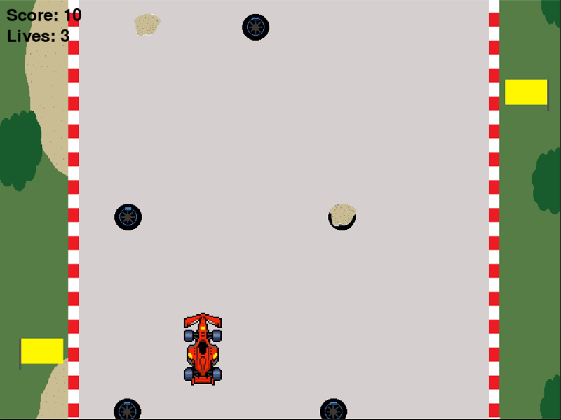
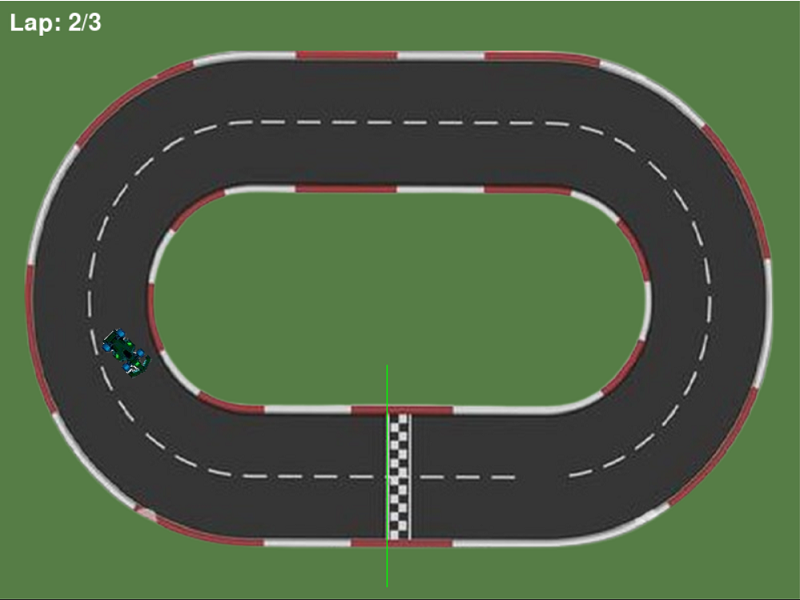
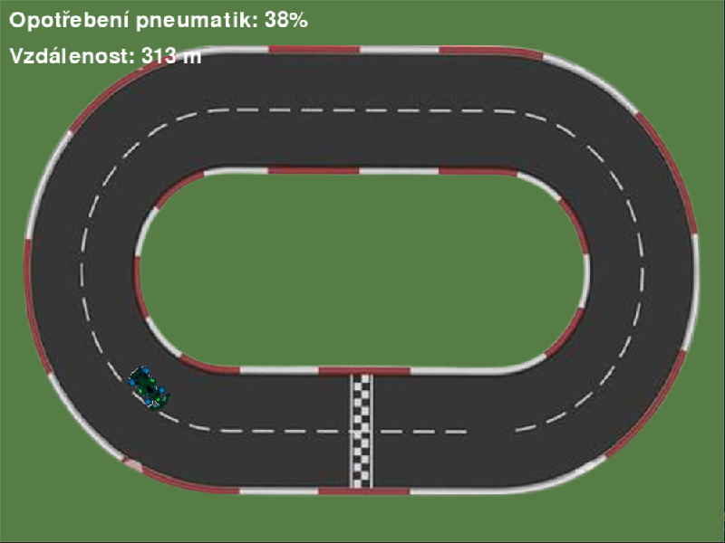

# Project-race
Toto je závodní hra s tématikou Formule 1. Program obsahuje tři minihry (Yellow flag, Green flag a Pitstop)

V každé minihře si můžete prohlédnout také tabulku nejlepších.

## Potřebné rozšíření
Pro hraní této hry jsou potřeba tyto rozšíření (pygame a sys)

## Minihry
### 1. Yellow flag
V této minihře jedete po nekonečné trati, a musíte se vyhýbat překážkám.

Cílem je vydržet co nejdéle a tím pádem nasbírat co nejvyšší skóre.

Ve hře můžete zrychlyt (zrychlí se rychlost i přičítání bodů) a zpomalit (spomalí se rychlost i přičítání bodů)

Jsou dva typy překážek): Pneumatika: Tato překážka vám odebere jeden život

                         Štěrk: Tato překážka vám odebere 10 bodů
                        

### 2. Green flag
V této minihře musíte co nejrychleji projet tři kola na jednoduché trati.
Pokud si skusíte zkrátit zatáčku tak vás hra vrátí na začátek kola.

### 3. Pitstop
V této minihře jedete po stejné trati jako v Green flag.
Při každém zatočení se odečítá životnost pneumatik.
Cílem hry je odjed co nejdelší vzdálenost.

## Ovládání
Menu se ovládá čísly na horní straně klávesnice a klávesou escape.
ve hrách se pohybujete šipkami.

## Spuštění
Hru spustíte v programu VisualStudio.
Po instalaci spusťte soubor main.py

## Ukázka

